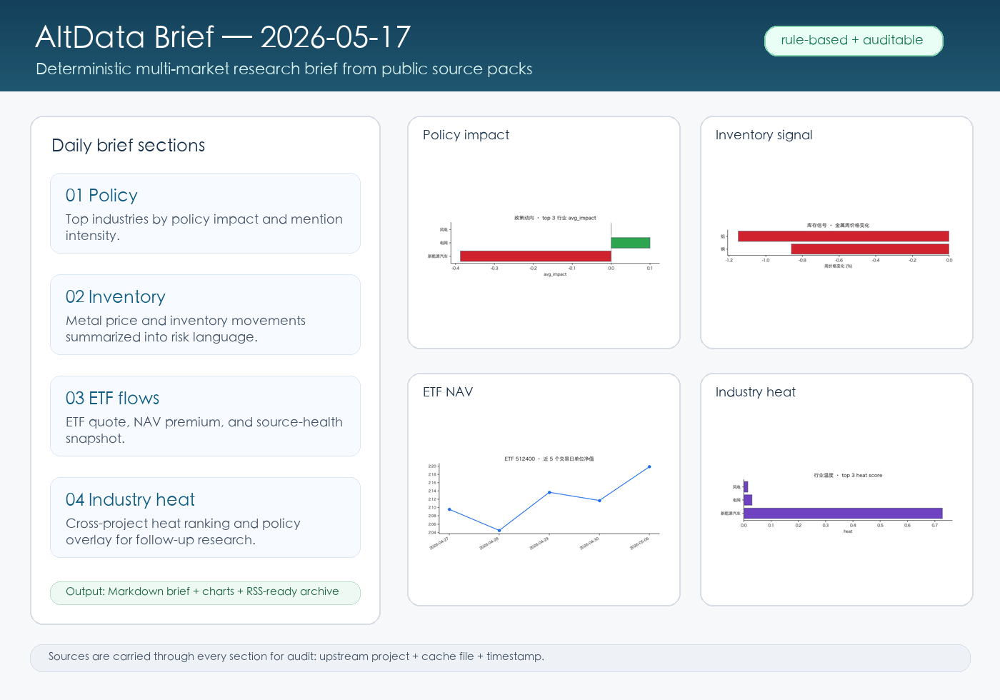
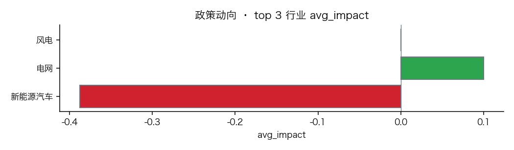
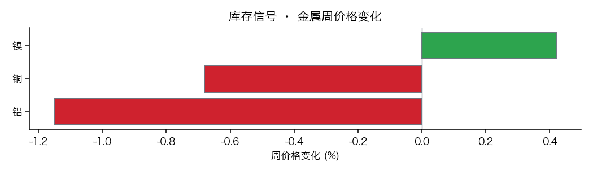
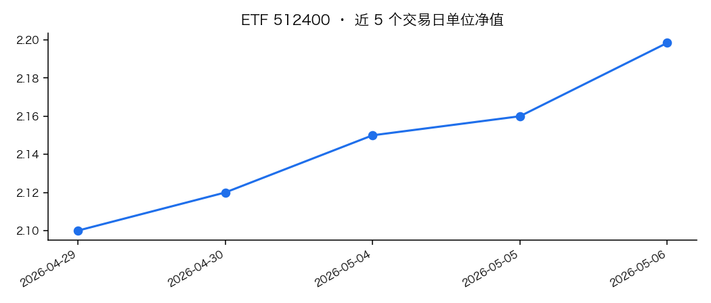
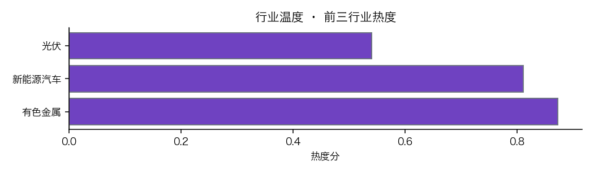
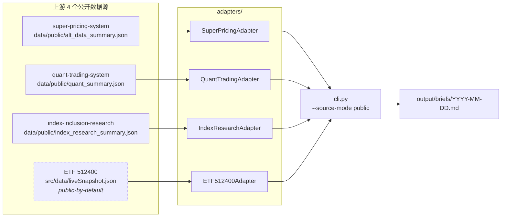

# AltData Brief · 多市场另类数据日报

[](https://github.com/Leonard-Don/altdata-brief/actions/workflows/ci.yml)


`altdata-brief` 是一个面向多市场的另类数据研究简报引擎，
当前每个交易日自动合成 4 个已公开摘要/快照数据源的真实信号。它是一份**可订阅、可引用、可复现**的 multi-market alt-data 视角；中国 A 股只是第一组 source pack，不再是产品边界。

`altdata-brief` produces deterministic research briefs over multi-market alt-data — currently synthesized from four public-source adapters I maintain. The goal is a reusable research-automation surface for source packs across markets.

<p align="center">
  
  <br />
  <sub>一份简报把政策动向、库存信号、ETF 资金流和行业温度合成为可版本化 Markdown + 图表 + RSS</sub>
</p>

<p align="center">
  
  
</p>
<p align="center">
  
  
</p>

---

## 1. 这是什么 / What this is

> 一句话：每个交易日 09:00 (UTC+8) 自动生成一份 5 段式 alt-data 简报，免费、版本化、有源可查。

每份简报包含：

| # | 段落 | 信号来源 | 数据形态 |
|---|---|---|---|
| 1 | **政策动向** | super-pricing-system / policy_radar | top-3 行业 avg_impact + mentions |
| 2 | **库存信号** | super-pricing-system / macro_hf | LME/SHFE 金属周价格变化 |
| 3 | **ETF 资金流** | ETF 512400 liveSnapshot | 行情 / NAV / source-health 评级 |
| 4 | **行业温度** | quant-trading-system | 行业 heat 排行 + 政策叠加 |
| 5 | **本日观察** | 全源跨切 | 默认 3 句确定性归纳；可选本地 LLM 改写 |

默认合成全部基于**确定性规则**，刻意"无聊但可靠"。`--with-llm` 只会改写「本日观察」一段，并且保留原始规则化文本；依赖缺失、调用失败、数字或行业名校验失败时都会回退到 deterministic 输出。这样新读者能复现，老读者能引用。

## 2. 为什么有它 / Why it exists

金融研究里，**主观评论是过剩的、可复现的数据视角是稀缺的**。我自己跑的量化工具已经能吐出 public-summary JSON / public snapshot，但它们如果只留在各自仓库里，就很难被连续比较、回放和审计。

`altdata-brief` 目前把 4 个公开可读的数据面拼成一份每日刊：

- 对**研究流程**：把分散信号汇总成一份可版本化、可复现、可回放的记录
- 对**上游项目**：把 public summary 的接口契约跑通，持续暴露 schema、 freshness 和 source-health 问题

## 3. 一份简报里有什么 / What's inside a daily brief

[点开示例 →](docs/sample_brief.md)

简报使用 Markdown 输出，可保存为本地研究归档，也可发布到 GitHub Pages / RSS。每段末尾附 `**Sources:**` 标注上游项目 + cache 文件名 + 时间戳，便于核查。

样例片段（来自 `docs/sample_brief.md`）：

```markdown
## 1. 政策动向

- **新能源汽车**：avg_impact=-0.388 (负向) · mentions=94 · 信号=利空
- **电网**：avg_impact=+0.100 (正向) · mentions=8 · 信号=中性
- **风电**：avg_impact=+0.050 (正向) · mentions=1 · 信号=中性

**Sources:** super-pricing-system::policy_radar.json · cache ts=`2026-05-05T11:00:55.113895`
```

每段配 1 张 matplotlib 图（与 [index-inclusion-research forest plot](https://github.com/Leonard-Don/index-inclusion-research) 同款风格）。

## 4. 当前数据源 / Current source pack

`altdata-brief` **不持有任何金融数据**——它只读取上游仓库已经公开的 summary/snapshot 文件。当前 source pack 偏中国权益市场；项目名已经松绑为 multi-market，是为了后续接入其它市场或资产类别时不再改产品边界。

| 项目 | 角色 | 上游 GitHub repo |
|---|---|---|
| `super-pricing-system` | 政策雷达 + 宏观高频 | `Leonard-Don/super-pricing-system` |
| `quant-trading-system` | 行业热度 + 政策叠加 | `Leonard-Don/quant-trading-system` |
| `index-inclusion-research` | CMA 7 条假说裁决 + PAP guard | `Leonard-Don/index-inclusion-research` |
| `ETF 512400` | 非铁金属 ETF 实时快照（public snapshot） | `Leonard-Don/ETF-512400` |

YieldWise / Android 等其它实验项目暂不进入当前 4-source brief surface，避免把未公开或未收口的信号混进日报。后续扩展优先通过新的 source pack / adapter 接入，而不是把更多实验项目硬塞进现有简报。

## 5. 示例简报 / Sample brief

[`docs/sample_brief.md`](docs/sample_brief.md) — 项目初始化时由真实缓存生成的一份。

## 6. 当前研究工具定位 / Current research-tool scope

现阶段不做销售转化或渠道运营。项目目标是把多来源 alt-data 的生成、校验、发布和回放流程打磨稳定。

- **研究工具优先**：输出面向自用研究、教学讨论和公开审计，不构成投资建议。
- **可复现优先**：默认使用 deterministic rules；LLM 只做可选改写 / 翻译，不生成新信号。
- **接口优先**：继续收敛 source adapter、public summary schema、freshness checks 和发布自动化。
- **扩展优先**：后续新增市场时，优先抽象 source pack，而不是围绕订阅或渠道运营设计功能。

## 7. 路线图 / Roadmap

| 版本 | 关键能力 | 状态 |
|---|---|---|
| **v0.1** | 4 个 cache 源接入 + 5 段式日报 + 4 张图 + GitHub Actions 模板 | ✅ 完成 |
| **v0.2** | 3 句式「本日观察」+ 数据质量 `validate` + RSS feed + 发布前保护 | ✅ 完成 |
| **v0.3** | `data/public/*_summary.json` 优先 + `--source-mode` + GitHub Actions 通路 | ✅ 完成 |
| **v0.4** | **4/4 adapter 全部接 public summary + 本地 e2e 烟测脚本 + CI fixture 通路 + `resolve_source()`** | ✅ 当前 |
| **v0.5** | macOS launchd 本地每日运行 + 稳定 `latest.md` 符号链接 + 失败 macOS 通知 | ✅ 完成 |
| **v0.6** | **gh-pages 自动发布管道 + Jekyll 主题 + 公共 URL** | ✅ 当前 |
| **v0.7** | 本地显式开启的 LLM 改写「本日观察」段；原文保留 + usage 记录 + 校验失败回退 | ✅ 完成 |
| **v0.8** | **双语 CN+EN 简报（LLM 翻译 + 数字/行业名校验回退）** | ✅ 完成 |
| **v0.9** | 每周五 18:00 本周回顾（aggregate 5 份日报为 themes/inflections/forecast） | ✅ 完成 |
| **v0.10** | Atom 1.0 feed + Open Graph 社交预览元数据 + 首页图表缩略图与订阅/分享入口 | ✅ 完成 |
| **v0.11** | **每月 1 日 17:00 上月回顾（aggregate ~20 份日报 + 4 份周报为 sustained themes / reversals / ETF MoM）** | ✅ 完成 |
| **v0.12** | **内容质量校验 `validate --strict`（指纹新鲜度 / 信号密度 / 跨源一致性 / schema 回归 / 占位符 / 时序一致性 / 必需上游路径）+ 上游 schema 版本闸门** | ✅ 当前 |
| **v1.0** | source pack 抽象 + 多市场配置化接入 + 非商业发布边界收敛 | 计划中 |

## 8. 快速开始 / Quickstart

```bash
git clone https://github.com/Leonard-Don/altdata-brief.git
cd altdata-brief
uv sync
uv run altdata-brief validate || test "$?" -eq 1  # WARN=1 可继续；FAIL=2 才阻断
uv run altdata-brief generate                     # auto: live → public → cache
uv run altdata-brief generate --source-mode public  # CI mode, public summaries only
```

生成结果落在 `output/briefs/YYYY-MM-DD.md`、`output/charts/YYYY-MM-DD/*.png`、`output/feed.xml` 与 `output/feed.atom`。周报/月报落在 `output/digests/` 并由同一个 publisher 发布。
发布/CI 场景请使用 `uv run altdata-brief validate --strict`：`--strict` 额外跑内容质量校验（指纹新鲜度 / 信号密度 / 跨源一致性 / schema 回归 / 占位符 / 时序一致性 / 必需上游路径）。每日 GitHub Actions 工作流允许 WARN 继续生成，避免上游公开摘要几天未刷新时把定时任务打红；需要人工阻断 WARN 时再额外加 `--fail-on-warn`。

### 可选 LLM 改写 / Optional LLM rephrase

默认 `generate` 不会调用 LLM。若只想把「本日观察」改写成更顺的新闻体中文，可在本机显式开启：

```bash
uv sync --extra llm
export ANTHROPIC_API_KEY=...
uv run altdata-brief generate --with-llm
uv run altdata-brief llm-usage
```

边界：

- LLM 只改写「本日观察」段，不生成新信号、不改写其他段落。
- 原始规则化版本会保留在简报折叠区；front matter 记录 `llm_requested`、`llm_rephrase_used`、`llm_status` 与原文 hash。
- 改写文本必须保留原始数字和行业/品种名；校验不通过就发布 deterministic 原文。
- 本项目输出仅供研究与教学讨论，不构成投资建议；LLM 改写不会改变这个边界。

### 双语版本 / Bilingual EN translation (v0.8)

从 v0.8 起，可以让 Claude 把当日中文简报翻成自然的专业英文，输出额外的 `output/briefs/YYYY-MM-DD.en.md` 文件——中文仍是 ground truth，英文是 LLM 翻译，供海外读者订阅。

```bash
uv sync --extra llm
export ANTHROPIC_API_KEY=...
uv run altdata-brief generate --with-llm --languages CN,EN
```

边界：

- **中文永远是 ground truth**——英文版本是加法（additive）侧通道，不会影响默认 CN 输出。
- 翻译时数字（百分比、价格、日期）必须 1:1 保留；行业名按 `src/altdata_brief/llm/industry_mapping.json` 的中英对照（如 `新能源汽车 → EV / new energy vehicles`、`电网 → power grid`、`有色金属ETF南方 → ChinaAMC SSE Non-Ferrous Metals ETF`）。
- 校验未通过、或 SDK / API key 缺失、或网络失败时，`.en.md` 仍会写盘，但内容是带 banner 的 CN 兜底——`translation_status: validation_failed | api_key_missing | sdk_missing` 标在 frontmatter。
- 单日双语成本：~1500 input + ~1000 output tokens ≈ $0.02（claude-3-5-sonnet 价格，2026 年报价）；按交易日全年 ≈ $5。
- RSS 每个日期会有 2 条 item：`[EN] ...` 前缀 + `:en` GUID 后缀；订阅端可按语言过滤。
- GitHub Pages 首页表格新增 `English` 列。

> The English translation is LLM-produced; the Chinese version is the authoritative source. Numbers (percentages, currency amounts, dates) are preserved exactly. Industry terms follow the curated CN→EN glossary at `src/altdata_brief/llm/industry_mapping.json`. If translation fails for any reason, the EN file still appears at the same URL with a banner explaining the fallback so subscribers never hit a 404.

### 数据源解析顺序 / Source resolution

从 v0.3 开始，每个 adapter 按以下顺序解析数据；v0.4 把这一套套到全部 4 个 adapter 上：

1. **Live endpoint** —— 仅在 `--source-mode live` 或 `ALTDATA_BRIEF_LIVE=1` 时尝试。
2. **Public summary** —— 上游项目仓库中的 `data/public/<source>_summary.json`（ETF 512400 例外，使用 `src/data/liveSnapshot.json`，因 JS app 已经提交进 git，属"public-by-default"）。GitHub Actions 沙箱唯一能读到的路径。
3. **Cache JSON / CSV** —— 仅本机，作为兜底。

`--source-mode public` 跳过 #3，缺失即报错——这是 CI 用的严格模式。
`--source-mode cache` 跳过 #1/#2，强制读本机 cache（用于回放历史）。
`altdata-brief validate` 在最末尾打印每个 adapter 的解析路径 + mtime，便于排查"为什么这次没读 public 而读了 cache"。



### 本地 e2e 烟测 / Local end-to-end smoke test

v0.4 新增 `scripts/smoke_e2e.sh`：在 tmp scratch 目录里复制 4 个上游的 public-summary 文件，模拟 GitHub Actions 环境跑 `validate + generate`：

```bash
bash scripts/smoke_e2e.sh              # 跑本机真实上游
SMOKE_FIXTURE=1 bash scripts/smoke_e2e.sh   # 跑 tests/fixtures/ 里的固定夹具（CI 用这条）
```

整套流程目标 <30 秒。CI 用 fixture 模式（避免跨仓依赖），本地用真实模式（兜实情）。

### macOS 本地每日运行 (launchd)

v0.5 起，可以直接在自己 Mac 上跑每日 brief，不再依赖 GitHub Actions 跨仓 PAT。launchd job 每个工作日 17:00（北京时间 / 收盘后）调用 `uv run altdata-brief generate --source-mode auto`，把结果写进 `output/briefs/YYYY-MM-DD.md`，并维护一个稳定的 `output/briefs/latest.md` 符号链接供外部读取（RSS、发布脚本等）。

```bash
# 一键安装：写 plist、launchctl load、自检
bash scripts/install_launchd_macos.sh

# 立刻手动跑一次（不用等 17:00），用来验证整套流程
bash scripts/run_now.sh

# 卸载
bash scripts/uninstall_launchd_macos.sh
```

日志在 `output/launchd_runs.log`（每次运行追加时间戳 + 完整 generate 输出）。job 非零退出时会通过 `osascript display notification` 弹一条 macOS 通知。

```bash
# 查看任务是否已排队
launchctl list | grep altdata

# 跟踪运行日志
tail -f output/launchd_runs.log
```

非 macOS 平台（Linux 服务器、WSL）使用常规 `cron` 即可：参见现有 `scripts/generate_daily.sh`，crontab 一行：

```cron
0 9 * * 1-5 /path/to/altdata-brief/scripts/generate_daily.sh >> /tmp/altdata-brief.log 2>&1
```

更深入：[docs/architecture.md](docs/architecture.md) · [docs/PUBLISHING.md](docs/PUBLISHING.md)

### v0.6 — gh-pages 自动发布 / Public live site

v0.6 起，每次 generate 之后会自动把 brief + charts + RSS/Atom feeds 推到 `gh-pages` 分支；v0.11 同一路径也会带上 weekly/monthly digests，由 GitHub Pages 渲染成静态站点：

> **Live URL**: [https://leonard-don.github.io/altdata-brief/](https://leonard-don.github.io/altdata-brief/) _(占位 / placeholder — once you run `gh repo create` + enable Pages, this is where readers land)_

```bash
# 手动跑一次 publish（默认 push 到 origin/gh-pages）
uv run altdata-brief publish

# 仅看会发生什么，不动 git
uv run altdata-brief publish --dry-run

# 重发某天的旧 brief
uv run altdata-brief publish --date 2026-05-16

# 只本地 commit，不 push（飞机模式）
uv run altdata-brief publish --no-push

# launchd 链式 publish 默认开启；临时关闭：
RUN_PUBLISH_AFTER_GENERATE=0 bash scripts/run_now.sh

# GitHub Actions 每日计划任务默认只 generate + publish dry-run；
# 手动 Run workflow 并把 publish=true 才会推送 gh-pages。
```

整套设置（含 `gh repo create` + GitHub Pages source 切换）见 [docs/PUBLISHING.md](docs/PUBLISHING.md)。

`gh-pages` 分支是 orphan 历史，与 `main` 完全独立——主仓库的提交历史不会被 publish 污染。`gh-pages-template/` 下的 Jekyll 模板每次 publish 会覆盖到分支上，所以站点样式只需在 `main` 上改一次。

发布页内置轻量实时刷新：浏览器每 60 秒无缓存探测当前页面，只有检测到新发布内容时才自动 reload。`briefs/latest.md` 也会随 publish 推到 `gh-pages`，适合固定打开“最新简报”入口等待本地/Actions 更新。

### v0.9 — 本周回顾 / Weekly digest (Friday cadence)

每个周五 18:00（北京时间，工作日收盘后 1 小时）自动聚合本周 5 份日报，输出一份 `本周回顾 / Weekly digest`，与日报放在同一 gh-pages 站点上：

```bash
# 立即生成本周（按 anchor 推断 Mon..Fri）
uv run altdata-brief weekly-digest

# 生成历史某一周（anchor 是该周任意工作日）
uv run altdata-brief weekly-digest --week-of 2026-05-14

# 提高 recurrence 门槛 → 主题更少但更强
uv run altdata-brief weekly-digest --recurrence-threshold 4

# 顺便生成英文版（复用 v0.8 翻译基础设施）
uv run altdata-brief weekly-digest --with-llm
```

数字落地：

- 文件位置：`output/digests/<iso_year>-W<week>.md`（如 `2026-W20.md`）
- gh-pages 上 mirror 到 `digests/<iso_year>-W<week>.md`，首页 `本周回顾 / Weekly digests` 表格列出全部 digest（CN + EN 双列）
- 周度合成内容：
  1. **本周核心主题** — 政策 / 库存维度在 ≥3 个交易日重复出现的行业 / 金属
  2. **信号反转** — 周内数值正负号至少翻转 1 次的 (行业, 信号类型) 对
  3. **行业累计影响** — 政策 avg_impact 周度累计（|值|前 8）
  4. **ETF 资金流摘要** — ETF 512400 日 NAV 变动累加
  5. **下周展望** — 持续 4 天以上的主题 + Thu/Fri 出现的反转
- RSS feed 同时包含日报与周报；周报 item 用 `[Weekly] ...` 前缀 + `:digest` GUID 后缀 + `<category>weekly-digest</category>`，订阅端可按 cadence 过滤
- 全部 5 段都是 **deterministic rule-based**——`--with-llm` 只用来产出 EN sibling

#### Friday 自动化

```bash
# 一键安装两个 launchd job (Mon-Fri 17:00 daily + Fri 18:00 weekly)
bash scripts/install_launchd_macos.sh

# 不等周五，手动验证整套流程：
bash scripts/weekly_digest_now.sh

# 卸载两个 job：
bash scripts/uninstall_launchd_macos.sh

# 查看两个 job 是否在列：
launchctl list | grep altdata
#  com.leonardodon.altdata-brief
#  com.leonardodon.altdata-brief.weekly
```

`scripts/weekly_digest_now.sh` 跑完后默认会链式调用 `scripts/publish_now.sh`，所以新 digest 周五就会出现在公共 URL。临时关闭：`RUN_PUBLISH_AFTER_DIGEST=0`。

更深入的 publishing 流程见 [docs/PUBLISHING.md §8](docs/PUBLISHING.md)。

### v0.11 — 上月回顾 / Monthly digest (1st-of-month cadence)

v0.11 闭环了 cadence trilogy：**daily（每个交易日）→ weekly（每周五）→ monthly（每月 1 日）**。月度回顾不是预测，是策略级回望——把上月所有 daily + weekly 揉成一份「持续/反转/累计」视角：

```bash
# 默认聚合 LAST month（与 1st-of-next-month launchd 节奏一致）
uv run altdata-brief monthly-digest

# 显式指定月份（YYYY-MM 或 YYYY-MM-DD 皆可）
uv run altdata-brief monthly-digest --month-of 2026-04
uv run altdata-brief monthly-digest --month-of 2026-04-15

# 提高 sustained 门槛（默认 12 天）
uv run altdata-brief monthly-digest --sustained-threshold 15

# 顺便生成英文版（复用 v0.8 翻译基础设施）
uv run altdata-brief monthly-digest --with-llm
```

数字落地：

- 文件位置：`output/digests/<YYYY-MM>.md`（如 `2026-04.md`），与 weekly digests 共用 `digests/` 目录；文件名形态（`2026-04` vs `2026-W18`）区分 cadence
- 月度合成内容：
  1. **月度核心主题** — 在 ≥12 天里持续出现的行业 / 金属（多周维度）
  2. **信号反转事件** — 月内每一次正负号翻转（不仅是最后一次）+ `flips_in_month` 排序
  3. **行业累计影响排行** — top 10
  4. **ETF 资金流月度变化** — 首日 / 末日 / 月内高 / 月内低
  5. **下月观察** — 持续到月末最后一周的主题（≥3 次）会被标为"下月继续跟踪"
- gh-pages 首页现在有 **三张表**：daily / weekly / monthly
- RSS / Atom feeds 包含 monthly items：`[Monthly]` 前缀 + `:monthly` GUID 后缀 + `<category>monthly-digest</category>`

#### 月初自动化

```bash
# 一键安装三个 launchd job (Mon-Fri 17:00 daily + Fri 18:00 weekly + Day 1 17:00 monthly)
bash scripts/install_launchd_macos.sh

# 不等 1 号，手动验证整套流程：
bash scripts/monthly_digest_now.sh

# 卸载三个 job：
bash scripts/uninstall_launchd_macos.sh

# 查看任务是否在列：
launchctl list | grep altdata
#  com.leonardodon.altdata-brief
#  com.leonardodon.altdata-brief.weekly
#  com.leonardodon.altdata-brief.monthly
```

`scripts/monthly_digest_now.sh` 在每月 1 日 17:00 跑；如果 1 号正好是周六/周日，wrapper 会自动把 run 延后到下周一（`MONTHLY_DEFER_WEEKENDS=0` 可关闭）。完成后默认链式调用 `scripts/publish_now.sh`，所以月度回顾月初就会出现在公共 URL。

更深入：[docs/PUBLISHING.md §9](docs/PUBLISHING.md)。

## 9. License

MIT.
