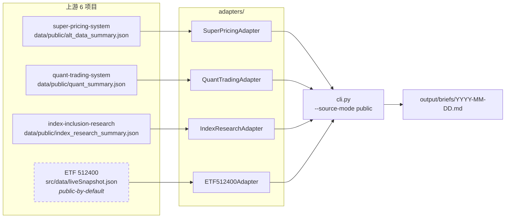

# CN AltData Brief · 中国另类数据日报

[](https://github.com/Leonard-Don/cn-altdata-brief/actions/workflows/ci.yml)


`cn-altdata-brief` 是一个每个交易日自动生成的另类数据研究简报，
合成自我自己运行的 6 个量化项目的真实信号缓存。它是一份**可订阅、可引用、可复现**的中国 A 股 alt-data 视角。

`cn-altdata-brief` produces a daily, deterministic research brief over China-equity alt-data — synthesized from 4 of the 6 quant projects I run locally. The goal is content-as-distribution: my own tools, made visible.

---

## 1. 这是什么 / What this is

> 一句话：每个交易日 09:00 (UTC+8) 自动生成一份 5 段式 alt-data 简报，免费、版本化、有源可查。

每份简报包含：

| # | 段落 | 信号来源 | 数据形态 |
|---|---|---|---|
| 1 | **政策动向** | super-pricing-system / policy_radar | top-3 行业 avg_impact + mentions |
| 2 | **库存信号** | super-pricing-system / macro_hf | LME/SHFE 金属周价格变化 |
| 3 | **ETF 资金流** | ETF 512400 liveSnapshot | 行情 / NAV / source-health 评级 |
| 4 | **行业温度** | quant-trading-system | 行业 heat 排行 + 政策叠加 |
| 5 | **本日观察** | 全源跨切 | 3 句确定性归纳，无 LLM |

合成全部基于**确定性规则**——v0.2 仍不接入 LLM，刻意"无聊但可靠"。这样新读者能复现，老读者能引用。

## 2. 为什么有它 / Why it exists

中文金融内容里，**主观评论是过剩的、可复现的数据视角是稀缺的**。我自己跑了 6 套量化工具，每个项目都自带 cache JSON 和评级面板，但它们只服务于我一个人——这是浪费。

`cn-altdata-brief` 把这 6 套工具拼成一份每日刊：

- 对**读者**：免费拿到一份来源可查的 alt-data 速报，不必再听"专家说"
- 对**我**：把分散的项目串成一个内容产品线，是付费订阅的 v0，也是外包询盘的展示作品

## 3. 一份简报里有什么 / What's inside a daily brief

[点开示例 →](docs/sample_brief.md)

简报使用 Markdown 输出，可直接发布到 GitHub Pages / Substack / 微信公众号。每段末尾附 `**Sources:**` 标注上游项目 + cache 文件名 + 时间戳，便于核查。

样例片段（来自 `docs/sample_brief.md`）：

```markdown
## 1. 政策动向

- **新能源汽车**：avg_impact=-0.388 (负向) · mentions=94 · 信号=利空
- **电网**：avg_impact=+0.100 (正向) · mentions=8 · 信号=中性
- **风电**：avg_impact=+0.050 (正向) · mentions=1 · 信号=中性

**Sources:** super-pricing-system::policy_radar.json · cache ts=`2026-05-05T11:00:55.113895`
```

每段配 1 张 matplotlib 图（与 [index-inclusion-research forest plot](https://github.com/Leonard-Don/index-inclusion-research) 同款风格）。

## 4. 数据源 = 我的项目组合 / The data sources are my portfolio

`cn-altdata-brief` **不持有任何金融数据**——它只读取我已有 6 个项目的 cache。这等同于把整套工具栈展开给读者看：

| 项目 | 角色 | 我的另一个 GitHub repo |
|---|---|---|
| `super-pricing-system` | 政策雷达 + 宏观高频 | `Leonard-Don/super-pricing-system` |
| `quant-trading-system` | 行业热度 + 政策叠加 | `Leonard-Don/quant-trading-system` |
| `index-inclusion-research` | CMA 7 条假说裁决 + PAP guard | `Leonard-Don/index-inclusion-research` |
| `ETF 512400` | 非铁金属 ETF 实时快照 | `Leonard-Don/ETF-512400` |
| `Yieldwise` | 利率曲线 (v0.2 接入) | `Leonard-Don/yieldwise` |
| `TianXianQuant Android` | 移动端实验 (v0.1 跳过) | `Leonard-Don/TianXianQuant` |

读者从一份简报顺藤摸瓜，能看到我所有项目的当前状态——这是"内容即分发"。

## 5. 示例简报 / Sample brief

[`docs/sample_brief.md`](docs/sample_brief.md) — 项目初始化时由真实缓存生成的一份。

## 6. 商业化分层（仍在试探）/ Monetization tiers (tentative)

| 档位 | 频次 | 渠道 | 价格 |
|---|---|---|---|
| **Free Daily Brief** | 每个交易日 | RSS + GitHub Pages + Substack | ¥0 |
| **Paid Weekly Deep-Dive** | 每周 | Substack 付费墙 | ¥39 / 月 |
| **Paid Quarterly Report** | 每季 | PDF 邮件交付 | ¥199 / 季 |

- **Weekly Deep-Dive** 包含：行业纵深 + 敏感性分析 + 可下载的 chart pack
- **Quarterly Report** 含：选定行业的 HS300 RDD 风格实证分析（脱胎自 `index-inclusion-research`）

定价仅供参考，会在 v1.0 上线前再校准。

## 7. 路线图 / Roadmap

| 版本 | 关键能力 | 状态 |
|---|---|---|
| **v0.1** | 4 个 cache 源接入 + 5 段式日报 + 4 张图 + GitHub Actions 模板 | ✅ 完成 |
| **v0.2** | 3 句式「本日观察」+ 数据质量 `validate` + RSS feed + 发布前保护 | ✅ 完成 |
| **v0.3** | `data/public/*_summary.json` 优先 + `--source-mode` + GitHub Actions 通路 | ✅ 完成 |
| **v0.4** | **4/4 adapter 全部接 public summary + 本地 e2e 烟测脚本 + CI fixture 通路 + `resolve_source()`** | ✅ 当前 |
| **v0.5** | Substack 自动发布 + 邮件订阅入口 + LLM 改写「本日观察」段 | 计划中 |
| **v1.0** | 付费墙上线 + Weekly Deep-Dive 实战 | 计划中 |

## 8. 快速开始 / Quickstart

```bash
git clone https://github.com/Leonard-Don/cn-altdata-brief.git
cd cn-altdata-brief
uv sync
uv run cn-altdata-brief validate || test "$?" -eq 1  # WARN=1 可继续；FAIL=2 才阻断
uv run cn-altdata-brief generate                     # auto: live → public → cache
uv run cn-altdata-brief generate --source-mode public  # CI mode, public summaries only
```

生成结果落在 `output/briefs/YYYY-MM-DD.md`、`output/charts/YYYY-MM-DD/*.png` 与 `output/feed.xml`。
发布/CI 场景请使用 `uv run cn-altdata-brief validate --fail-on-warn`，把 WARN 也升级为阻断。

### 数据源解析顺序 / Source resolution

从 v0.3 开始，每个 adapter 按以下顺序解析数据；v0.4 把这一套套到全部 4 个 adapter 上：

1. **Live endpoint** —— 仅在 `--source-mode live` 或 `CN_ALTDATA_BRIEF_LIVE=1` 时尝试。
2. **Public summary** —— 上游项目仓库中的 `data/public/<source>_summary.json`（ETF 512400 例外，使用 `src/data/liveSnapshot.json`，因 JS app 已经提交进 git，属"public-by-default"）。GitHub Actions 沙箱唯一能读到的路径。
3. **Cache JSON / CSV** —— 仅本机，作为兜底。

`--source-mode public` 跳过 #3，缺失即报错——这是 CI 用的严格模式。
`--source-mode cache` 跳过 #1/#2，强制读本机 cache（用于回放历史）。
`cn-altdata-brief validate` 在最末尾打印每个 adapter 的解析路径 + mtime，便于排查"为什么这次没读 public 而读了 cache"。



### 本地 e2e 烟测 / Local end-to-end smoke test

v0.4 新增 `scripts/smoke_e2e.sh`：在 tmp scratch 目录里复制 4 个上游的 public-summary 文件，模拟 GitHub Actions 环境跑 `validate + generate`：

```bash
bash scripts/smoke_e2e.sh              # 跑本机真实上游
SMOKE_FIXTURE=1 bash scripts/smoke_e2e.sh   # 跑 tests/fixtures/ 里的固定夹具（CI 用这条）
```

整套流程目标 <30 秒。CI 用 fixture 模式（避免跨仓依赖），本地用真实模式（兜实情）。

更深入：[docs/architecture.md](docs/architecture.md) · [docs/monetization_plan.md](docs/monetization_plan.md)

## 9. License + Contact

MIT.

* Author: [Leonard-Don](https://github.com/Leonard-Don)
* For outsourcing / collaboration inquiries: this repo IS my portfolio — open an issue or DM on Boss/Upwork.
